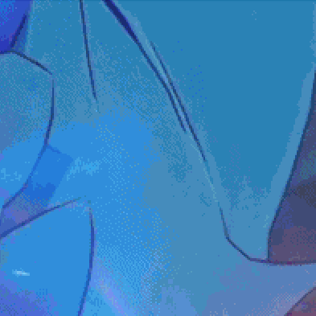
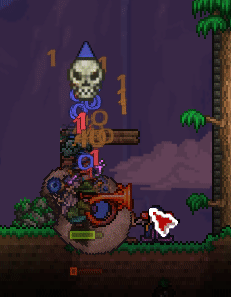

# GIF Compressor

GIF compression tool that focuses on undoing error diffusion dithering.

## Background

GIFs are a paletted image format with 256 colours maximum per frame, which often leads to colour quantization artifacts. Error diffusion dithering, such as Floyd-Steinberg, is very commonly applied by default to GIFs to mitigate this.

However, dithering greatly harms compression (such as LZW) due to repeated irregular patterns, leading to GIFs that barely reduce in file size from regular compression tools. By undoing the dithering, significant reductions in file size can be achieved, at the cost of some colour banding artifacts.

## How it works

A heuristic based on [this project](https://github.com/kornelski/undither) was adapted for GIFs to identify dithering patterns. After all frames are undithered, an optimized global palette is created using the median cut algorithm. This new palette is used in the requantization of the unpaletted frames to produce a valid GIF. A k-d tree is used instead of a VP tree to support the nearest neighbour queries for these tasks.

Below is a zoomed in sample of the dithering removal. It's not a perfect process because error diffusion dithering is lossy.
|Before (Dithered)|After (Undithered & requantized)|
| ----------- | ----------- |
|||

## Usage

```cargo run --release -- -h```
```
  -i, --input FILE               (Mandatory) Specify the input file path.
  -o, --output FILE              (Mandatory) Specify the output file path.
  -h, --help                     Prints this help message.
  -s, --stream                   Instructs the program to not store all GIF frames in memory at once. Leads to reduced peak memory usage at the cost of longer runtime.
  -t, --transparency INTEGER     Specify a non-negative colour distance threshold for transparency optimization. Default: 5
```

eg. `cargo run --release -- -i input.gif -o output.gif`


## Showcase

The program output is compared to the file size of running [gifsicle](https://github.com/kohler/gifsicle) with the `-O3` and `--lossy=200` arguments on the same input.

|Input|Gifsicle (-O3 --lossy=200)|Program Output|
| ----------- | ----------- | ----------- |
|28.7 MB <br> |25.6 MB (-11%)| 19 MB (-34%) <br>|
|3.6 MB <br> |2.5 MB (-31%)| 2.1 MB (-42%) <br>|
|80.3 MB <br> |64.2 MB (-20%)| 41 MB (-49%) <br>|
|78.8 MB <br> |38 MB (-52%)| 30.9 MB (-61%)<br>|
